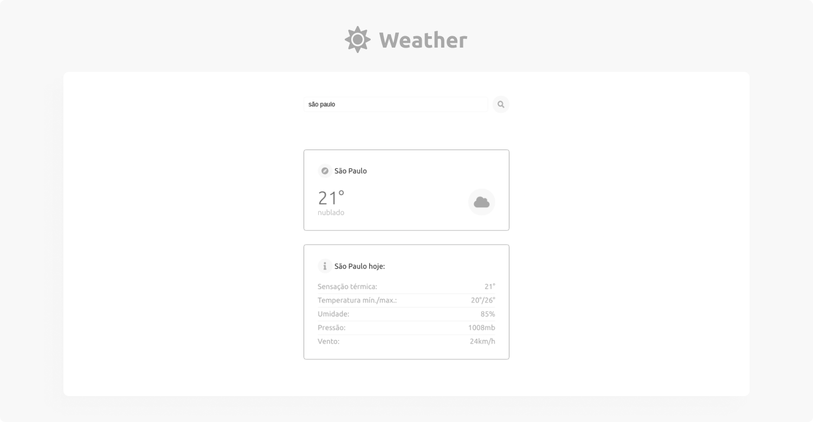

<h1 align="center">☀️ Weather</h1>



> Um projeto que mostra informações sobre o clima de uma cidade.

## 📃 Conteúdo
  1. [Tecnologias](#-tecnologias)
  2. [Ideia](#-ideia)
  3. [Como funciona](#-como-funciona)
  4. [Veja o projeto](#-teste-o-projeto)
  5. [Instalação](#-instalação)

## 📡 Tecnologias

  - [React](https://reactjs.org/)
  - [Vite](https://vitejs.dev/)
  - [TypeScript](https://www.typescriptlang.org/)
  - [Styles Components](https://styled-components.com/)
  - [Axios](https://axios-http.com/)

## 💡 Ideia

  A ideia do projeto foi tirada do repositório [app-ideas](https://github.com/florinpop17/app-ideas).

## 🤔 Como funciona?

  1. O nome da cidade é digitado em um form e guardado em um state.
  2. As informações do local são requisitadas a partir de um get do Axios.
  3. Os dados da cidade são compartilhados via context API, que são retornados na tela.

## 🚀 Teste o projeto

  O projeto está na [Vercel](https://vercel.com), clique [aqui](https://my-meme-generator.vercel.app) para testar.

## ⬇ Instalação

  ```bash
  # Clone este repositório
  git clone git@github.com:GustavoSrr/weather.git
  # Entre na pasta gerada
  cd weather
  # Baixe as dependências
  npm i
  # ou
  yarn
  # Inicie o projeto
  npm start
  # ou
  yarn dev
```
